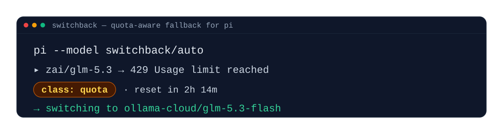

# pi-extension-switchback

Quota-aware graceful model fallback for [pi](https://github.com/earendil-works/pi).



`switchback` registers a virtual model `switchback/auto`. Every request is
routed through your configured fallback list; provider failures are
classified by a single SystemOne classifier and the router advances on
quota / auth / unknown, retries on transient, sticks on context overflow.
When no classifier is available the router visibly notifies and cycles to
the next non-blocked entry — the cycle is the universal baseline.

Classifier-only by design: no keyword sets, no regex, no heuristics.

## Quickstart

```bash
pi install https://github.com/jr2804/switchback.git
pi --model switchback/auto
```

Verify in the TUI:

```text
/switchback                    # status, effective vs greyed entries, active blocks
/switchback-config             # config source + ordered fallback list
```

And a live call:

```bash
pi --model switchback/auto -p "ping" --no-tools   # -> pong
```

## Commands

| Command | What it does |
|---------|--------------|
| `/switchback` | Show current source, effective vs greyed entries (with reason), active blocks with reset time. |
| `/switchback-config` | Show the active config source and the full fallback list with per-entry availability markers. |
| `/switchback-blocked` | List models currently blocked by the router, with minutes until reset. Entries auto-disappear after their reset time passes (lazy prune on read). |
| `/switchback-crashes [n]` | List the most-recent N entries from the global crash store (default 10). Each row shows short-hash, provider/model, class-or-reason, count, last-seen, and an `[annot]` marker for user-annotated entries. |
| `/switchback-annotate <hash> <quota\|auth\|transient\|overflow\|unknown> [note...]` | Write a user-confirmed class onto a stored crash. After annotation, the Tier 2b cache short-circuits the classifier call for the exact raw bytes. Hash must be a unique ≥4-char prefix; class must be one of the five listed; ambiguous or unknown prefix produces a clear error. |
| `/switchback-simulate <scenario>` | Run a fixture scenario from `switchback.simulate.json` through the router without burning real quota. |

## Configuration

`switchback.yaml` is the single user config format (YAML only). Lookup order:

1. `<cwd>/.pi/switchback.yaml` (per-project override; `.pi/` is gitignored, so it never lands in a repo)
2. `~/.pi/agent/switchback.yaml`
3. Built-in `DEFAULT_CONFIG` (empty `fallbacks: []` — surfaces a `ConfigError`).

The repo ships only `switchback.yaml.example` as the template.

The optional `jev:` entry names a classifier (SystemOne); with `baseUrl` set, switchback
registers a local endpoint itself (e.g. an Ollama v0.35+ decision model) — see
[docs/configuration.md#classifier-jev](docs/configuration.md#classifier-jev).

Greyed-out entries (model not in catalog or provider unavailable) are
skipped at route time; the config is left untouched and they recover
automatically when they reappear. Full reference:
[docs/configuration.md](docs/configuration.md).

## Docs

- [Configuration](docs/configuration.md)
- [Classifier — live validation + coverage matrix](docs/classifier.md)
- [License](docs/license.md)

The full docs site (with the **Development** section for maintainers and
contributors) is published with MkDocs Material — see
[`mkdocs.yml`](mkdocs.yml).

## License

MIT — see [LICENSE](LICENSE). Copyright (c) 2026 jr2804.
